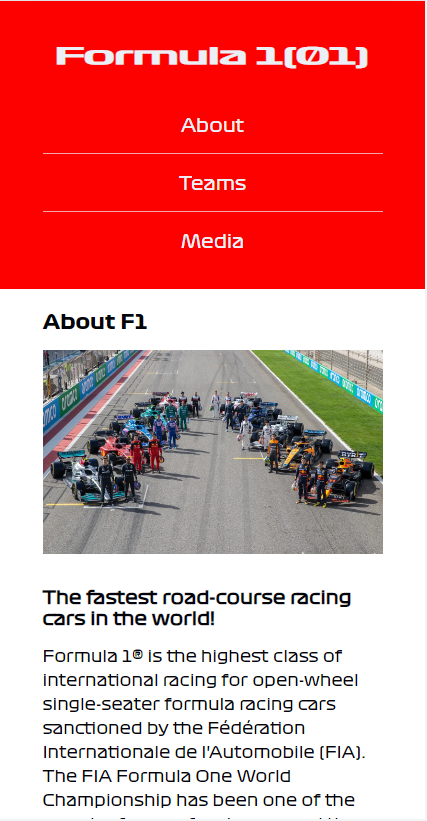
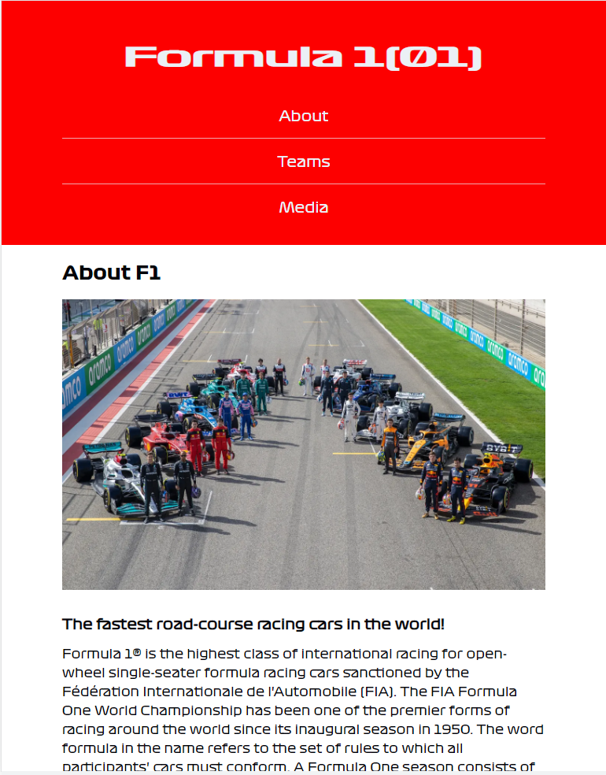
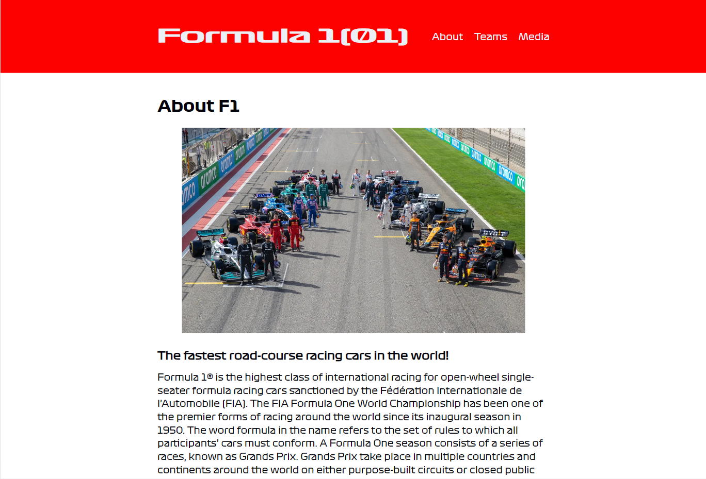
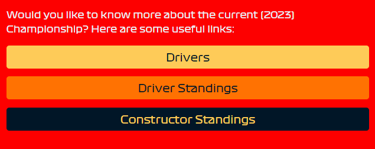
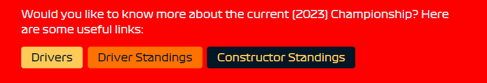
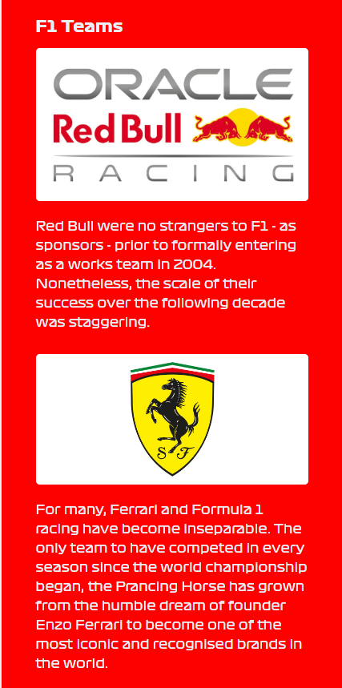
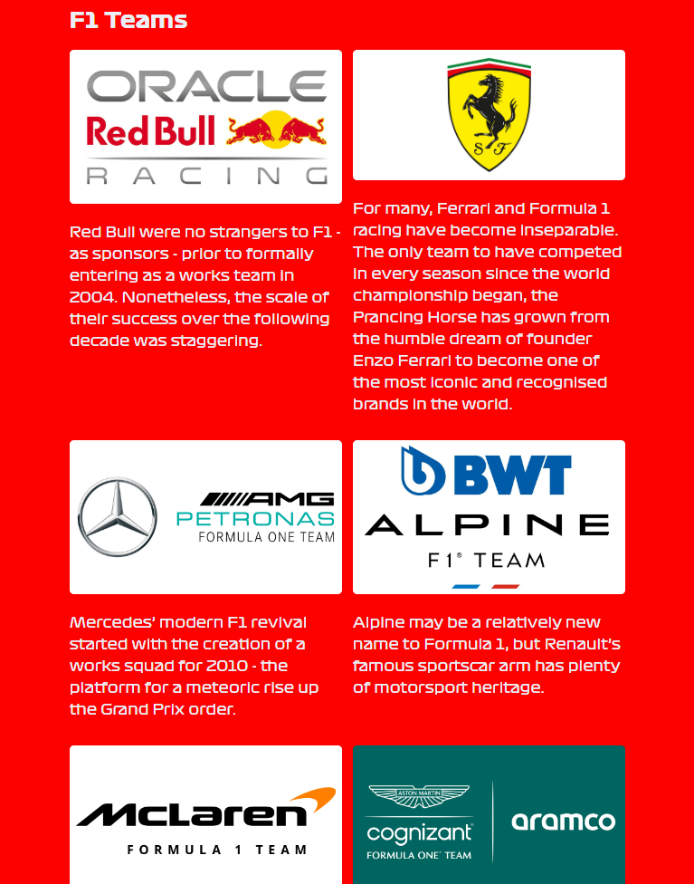
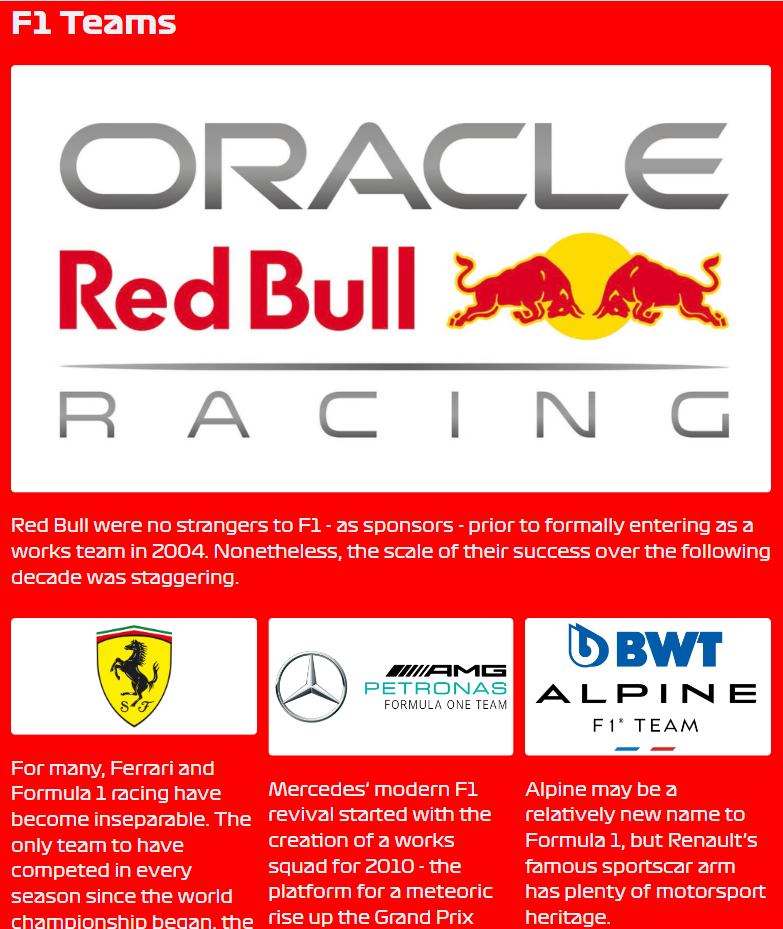

# Scrimba - The Frontend Developer Carrer Path - Module 6 - Responsive site

Hello and welcome! Thank you for stopping by.🤠

This is a solution to the "Responsive site" project from _Module 6 - Responsive site_ of the [The Frontend Career Path](https://scrimba.com/learn/frontend).

## Table of contents

- [Overview](#overview)
  - [The project](#the-challenge)
  - [How to use the site](#how-to-use-the-app)
  - [Screenshot](#screenshot)
  - [Links](#links)
- [My process](#my-process)
  - [Built with](#built-with)
  - [What I learned](#what-i-learned)
  - [Continued development](#continued-development)
- [Author](#author)
- [Acknowledgments](#acknowledgments)
- [About Scrimba](#about-scrimba)

## Overview

### The project

The site is built with:

- Responsive design
- Mobile first approach
- Functional links to other pages

### How to use the site

It's simple. 😉 An user opens the site via the link https://petrvalenta92.github.io/my-first-responsive-site/ on his/her smartphone or computer.
The navigation will takes him/her to the different sections of the page. S/he can click on different links to get to related pages.
If the user wants to see the design of the page, he/she can use the "Dev Tools", which can be accessed using the F12 key (or by pressing the right mouse button and selecting "Inspect").

### Screenshot

_Navigation menu_

Navigation - mobile (425px)

Navigation - tablet (768px)

Navigation - monitor (1440px)

_Buttons_

Buttons - monitor (768px)

Buttons - monitor (1440px)

_Teams section_

Teams section - mobile (425px)

Teams section - tablet (768px)

Teams section - monitor (1440px)

### Links

- Solution URL: [Github Repository](https://github.com/PetrValenta92/my-first-responsive-site)
- Live Site URL: [Github Pages](https://petrvalenta92.github.io/my-first-responsive-site/)

## My process

### Built with

- Semantic HTML5 markup
- CSS custom properties
- CSS pseudoclasses
- Flexbox
- Flex Wrap
- Mobile first
- Responsive design
- Media queries
- Relative units

### What I learned

I have had created this page based on the project I created during the lesson _Module 6 - Responsive site_.
Then I modified the page topic, added new color custome properties, add new suitable fonts and included links to related web pages.
I added a few breakpoints to make the site even more user-friendly.

### Continued development

In the future I'd like to update the Teams section layout with GRID technology to be more responsive.

## Author

- Website - _to be added..._
- GitHub - [@PetrValenta92](https://github.com/PetrValenta92)
- LinkedIn - [@valentapetr](https://www.linkedin.com/in/valentapetr/)
- Instagram - [@petr_thedev](https://www.instagram.com/petr_thedev/)

## Acknowledgments

I would love to thank whole [Scrimba](https://scrimba.com) team for such amazing project they have created. I want to thank the Scrimba community and specialy the [Junior Guru Community](https://junior.guru/) community! 🐣

## About Scrimba

At Scrimba our goal is to create the best possible coding school at the cost of a gym membership! 💜
If we succeed with this, it will give anyone who wants to become a software developer a realistic shot at succeeding, regardless of where they live and the size of their wallets 🎉
The Frontend Developer Career Path aims to teach you everything you need to become a Junior Developer, or you could take a deep-dive with one of our advanced courses 🚀

- [Our courses](https://scrimba.com/allcourses)
- [The Frontend Career Path](https://scrimba.com/learn/frontend)
- [Become a Scrimba Pro member](https://scrimba.com/pricing)

Happy Coding!
